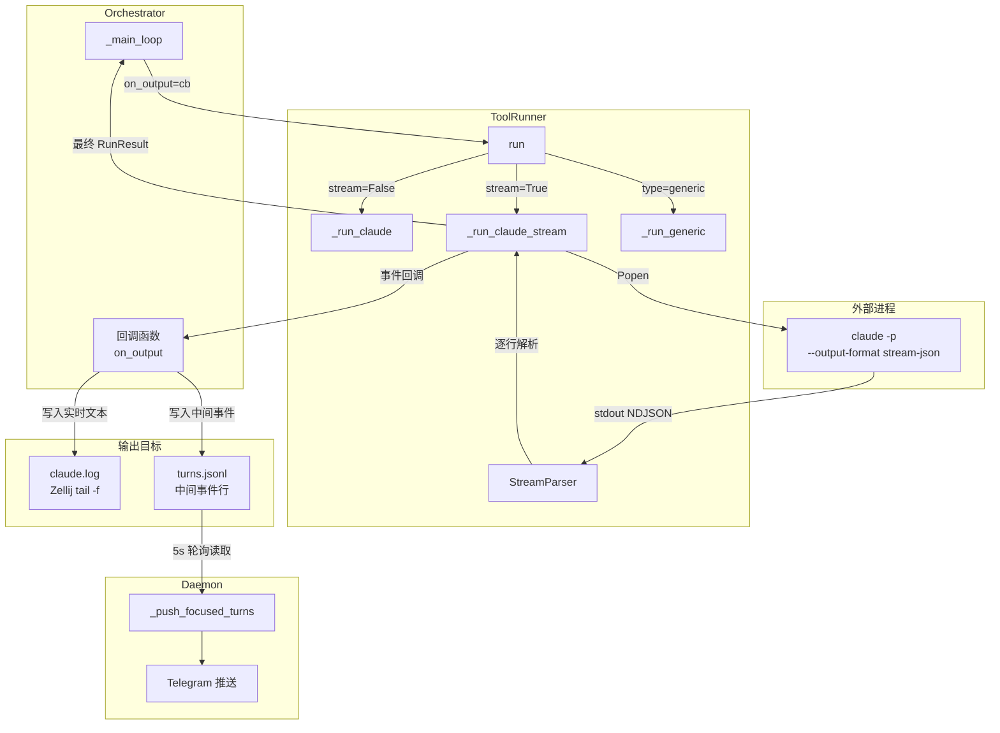

# 系统设计：stream-json-toolrunner

## 架构概览



## 模块划分

### 模块 A：StreamParser（新增内部类）

- **职责**：解析 Claude Code `stream-json` NDJSON 输出流，提取结构化数据
- **文件位置**：`src/maestro/tool_runner.py` 内部类
- **核心逻辑**：
  - 逐行读取 stdout，每行 `json.loads` 解析为事件对象
  - 根据 `type` 字段路由到对应处理函数
  - 累积 assistant 文本内容、提取 session_id、cost_usd 等元数据
  - 最终组装 `RunResult`

### 模块 B：_run_claude_stream（新增方法）

- **职责**：使用 `subprocess.Popen` + `stream-json` 模式运行 Claude Code
- **文件位置**：`src/maestro/tool_runner.py` 的 `ToolRunner` 类方法
- **核心逻辑**：
  - 构建命令行参数（`--output-format stream-json`）
  - 启动 Popen 进程
  - 在 readline 循环中调用 StreamParser 解析事件
  - 超时控制（`threading.Timer`）
  - 通过回调函数实时推送有意义的事件

### 模块 C：Orchestrator 回调集成（修改）

- **职责**：在 `_main_loop` 中传入回调函数，将实时输出写入日志和事件文件
- **文件位置**：`src/maestro/orchestrator.py`
- **核心逻辑**：
  - 定义回调函数，接收事件类型和文本
  - 将实时文本追加写入 `claude.log`（Zellij 面板）
  - 将中间事件追加写入 `turns.jsonl`（Daemon 读取推送）

### 模块 D：配置扩展（修改）

- **职责**：在 `CodingToolConfig` 中新增 `stream` 字段
- **文件位置**：`src/maestro/config.py`、`config.example.yaml`

## 数据模型

### StreamEvent（内部数据结构，不持久化）

```python
@dataclass
class StreamEvent:
    """stream-json 单行事件的解析结果"""
    type: str            # system | assistant | user | result | stream_event
    subtype: str = ""    # init（system）、success/error_*（result）
    text: str = ""       # assistant 文本内容 / result 文本
    session_id: str = ""
    cost_usd: float = 0.0
    is_error: bool = False
    error_type: str = ""
    duration_ms: int = 0
    num_turns: int = 0
    raw: dict = field(default_factory=dict)  # 原始 JSON 对象
```

### RunResult（不变）

```python
@dataclass
class RunResult:
    """单轮执行结果（字段定义完全不变）"""
    output: str
    session_id: str = ""
    cost_usd: float = 0.0
    duration_ms: int = 0
    is_error: bool = False
    error_type: str = ""
```

### 回调函数签名

```python
# 回调类型定义
from typing import Callable, Optional

OutputCallback = Callable[[str, str], None]
# 参数：(event_type: str, text: str)
# event_type: "assistant" | "tool_use" | "tool_result" | "system" | "result"
# text: 对应的文本内容
```

### turns.jsonl 中间事件行（新增事件类型）

```json
{
    "type": "stream_output",
    "turn": 3,
    "text": "正在分析代码结构...",
    "event_type": "assistant",
    "timestamp": "2026-02-26T12:00:00"
}
```

与现有轮次事件（`turn`、`action`、`reasoning` 等字段）兼容共存。Daemon 通过 `type` 字段区分：
- 无 `type` 字段 → 旧格式轮次事件
- `type == "stream_output"` → 中间流式事件

## Claude Code stream-json 事件格式参考

基于 Claude Code CLI 实际输出，`--output-format stream-json` 产出的 NDJSON 流包含以下事件类型：

### 1. system（init）

```json
{"type":"system","subtype":"init","session_id":"abc123","tools":["Read","Edit","Bash"]}
```

### 2. assistant（消息内容）

```json
{"type":"assistant","message":{"id":"msg_xxx","content":[{"type":"text","text":"我来分析一下..."}],"role":"assistant"}}
```

assistant 事件的 `message.content` 是数组，可能包含：
- `{"type":"text","text":"..."}` — 文本块
- `{"type":"tool_use","id":"tu_xxx","name":"Read","input":{...}}` — 工具调用

### 3. user（工具结果）

```json
{"type":"user","message":{"content":[{"type":"tool_result","tool_use_id":"tu_xxx","content":"文件内容..."}]}}
```

### 4. result（最终结果，始终最后一行）

```json
{
    "type":"result",
    "subtype":"success",
    "session_id":"abc123",
    "is_error":false,
    "result":"任务完成，已修改 3 个文件",
    "total_cost_usd":0.0523,
    "duration_ms":45000,
    "duration_api_ms":38000,
    "num_turns":5
}
```

`subtype` 可能的值：`success`、`error_max_turns`、`error_tool`、`error_api` 等。

### 5. stream_event（token 级流式，需 `--verbose --include-partial-messages`）

```json
{"type":"stream_event","event":{"type":"content_block_delta","index":0,"delta":{"type":"text_delta","text":"我"}}}
```

> **设计决策**：Maestro 不使用 `--verbose --include-partial-messages` 标记，因此不会收到 `stream_event`。Maestro 只需要消息级别的粒度（assistant/user/result），不需要 token 级别流式。这简化了解析逻辑，减少了事件处理频率。

## 关键设计决策

| 决策点 | 选项 | 选择 | 理由 |
|--------|------|------|------|
| 进程管理方式 | asyncio.subprocess / subprocess.Popen | Popen | Orchestrator 是同步代码，不引入 asyncio 保持一致性 |
| 超时实现 | threading.Timer / 循环内时间检查 | threading.Timer | Timer 精度更高，不受 readline 阻塞影响。readline 可能阻塞数十秒（Claude 在执行长任务时无输出），循环内检查无法及时触发 |
| 流式粒度 | token 级（stream_event）/ 消息级（assistant/user） | 消息级 | Maestro 不需要逐字符显示，消息级足够支撑 Zellij 面板和 Telegram 推送。避免 `--verbose` 产生大量 token 事件 |
| 回调触发时机 | 每个 NDJSON 行 / 仅有意义事件 | 仅有意义事件 | 跳过 system(init) 和 user(tool_result) 的回调，只对 assistant 文本和 result 触发回调，减少噪声 |
| 回调线程模型 | 主线程同步 / 独立线程异步 | 主线程同步 | 回调仅做文件写入，微秒级完成，无需异步。避免线程安全问题 |
| 无回调时的行为 | 特殊分支 / 统一流程 | 统一流程 | `on_output=None` 时 StreamParser 照常工作，仅跳过回调调用。最终返回的 RunResult 完全一致 |
| 中间事件推送到 Telegram | 回调直接推送 / 写文件由 Daemon 轮询 | 写文件由 Daemon 轮询 | 避免在回调中引入异步网络 IO，避免 Telegram 限流（30 msg/s），复用 Daemon 已有的 5s 轮询机制 |
| result 事件缺失的降级策略 | 报错 / 从 assistant 文本组装 | 从 assistant 文本组装 | Claude Code 进程崩溃时可能没有 result 事件，降级方案保证 RunResult 始终有内容 |
| 新方法 vs 修改原方法 | 修改 _run_claude / 新增 _run_claude_stream | 新增 _run_claude_stream | 保留原 _run_claude 不变，stream=False 时的行为完全不受影响。两种模式共存，互不干扰 |

## 详细设计

### 1. StreamParser 类

```python
@dataclass
class StreamEvent:
    """stream-json 单行事件"""
    type: str
    subtype: str = ""
    text: str = ""
    session_id: str = ""
    cost_usd: float = 0.0
    is_error: bool = False
    error_type: str = ""
    duration_ms: int = 0
    num_turns: int = 0
    raw: dict = field(default_factory=dict)


class StreamParser:
    """解析 Claude Code stream-json NDJSON 输出"""

    def __init__(self):
        self.session_id: str = ""
        self.accumulated_text: str = ""     # assistant 文本累积
        self.result_event: Optional[dict] = None
        self.cost_usd: float = 0.0
        self.is_error: bool = False
        self.error_type: str = ""
        self.duration_ms: int = 0

    def parse_line(self, line: str) -> Optional[StreamEvent]:
        """
        解析一行 NDJSON

        返回 StreamEvent 或 None（解析失败/空行）。
        同时更新内部状态（session_id、accumulated_text 等）。
        """
        line = line.strip()
        if not line:
            return None

        try:
            data = json.loads(line)
        except json.JSONDecodeError:
            logger.warning(f"stream-json 行解析失败，已跳过: {line[:100]}")
            return None

        event_type = data.get("type", "")

        if event_type == "system":
            return self._handle_system(data)
        elif event_type == "assistant":
            return self._handle_assistant(data)
        elif event_type == "user":
            return self._handle_user(data)
        elif event_type == "result":
            return self._handle_result(data)
        else:
            # 未知事件类型（如 stream_event），忽略
            return StreamEvent(type=event_type, raw=data)

    def build_run_result(self, elapsed_ms: int) -> RunResult:
        """
        从累积状态构建最终 RunResult

        优先使用 result 事件的数据，降级到 accumulated_text。
        """
        if self.result_event:
            return RunResult(
                output=self.result_event.get("result", "") or self.accumulated_text,
                session_id=self.session_id,
                cost_usd=self.result_event.get("total_cost_usd", 0.0),
                duration_ms=self.result_event.get("duration_ms", elapsed_ms),
                is_error=self.result_event.get("is_error", False),
                error_type=self.result_event.get("subtype", ""),
            )
        else:
            # 没有 result 事件（进程崩溃），降级
            logger.warning("未收到 result 事件，从 assistant 文本降级组装输出")
            return RunResult(
                output=self.accumulated_text or "[错误] Claude Code 未返回有效输出",
                session_id=self.session_id,
                duration_ms=elapsed_ms,
                is_error=True,
                error_type="no_result_event",
            )

    def _handle_system(self, data: dict) -> StreamEvent:
        """处理 system 事件（提取 session_id）"""
        if data.get("subtype") == "init":
            self.session_id = data.get("session_id", self.session_id)
        return StreamEvent(
            type="system",
            subtype=data.get("subtype", ""),
            session_id=data.get("session_id", ""),
            raw=data,
        )

    def _handle_assistant(self, data: dict) -> StreamEvent:
        """处理 assistant 事件（提取文本内容）"""
        text_parts = []
        message = data.get("message", {})
        for block in message.get("content", []):
            if block.get("type") == "text":
                text_parts.append(block.get("text", ""))

        text = "\n".join(text_parts)
        if text:
            self.accumulated_text += text + "\n"

        return StreamEvent(
            type="assistant",
            text=text,
            raw=data,
        )

    def _handle_user(self, data: dict) -> StreamEvent:
        """处理 user 事件（工具执行结果，不累积到输出）"""
        return StreamEvent(
            type="user",
            raw=data,
        )

    def _handle_result(self, data: dict) -> StreamEvent:
        """处理 result 事件（最终结果，提取所有元数据）"""
        self.result_event = data
        self.session_id = data.get("session_id", self.session_id)

        return StreamEvent(
            type="result",
            subtype=data.get("subtype", ""),
            text=data.get("result", ""),
            session_id=data.get("session_id", ""),
            cost_usd=data.get("total_cost_usd", 0.0),
            is_error=data.get("is_error", False),
            error_type=data.get("subtype", ""),
            duration_ms=data.get("duration_ms", 0),
            num_turns=data.get("num_turns", 0),
            raw=data,
        )
```

### 2. _run_claude_stream 方法

```python
def _run_claude_stream(self, instruction: str,
                       on_output: Optional[Callable[[str, str], None]] = None
                       ) -> RunResult:
    """
    Claude Code 流式模式：Popen + --output-format stream-json

    参数:
        instruction: 发给 Claude Code 的指令
        on_output: 可选回调，签名 (event_type: str, text: str) -> None

    返回:
        RunResult（与 _run_claude 完全兼容）
    """
    cmd = [self.config.command, "-p", "--output-format", "stream-json"]
    if self.config.auto_approve:
        cmd.append("--dangerously-skip-permissions")
    if self.session_id:
        cmd.extend(["--resume", self.session_id])
    cmd.append(instruction)

    logger.info(f"执行 Claude Code 流式模式（session={self.session_id or '新建'}）")

    start = time.time()
    parser = StreamParser()
    process = None
    timer = None

    try:
        process = subprocess.Popen(
            cmd,
            stdout=subprocess.PIPE,
            stderr=subprocess.PIPE,
            text=True,
            cwd=self.working_dir,
        )

        # 超时控制：Timer 到期后 kill 进程
        def _on_timeout():
            if process and process.poll() is None:
                logger.error(f"Claude Code 流式模式超时 ({self.config.timeout}s)")
                process.kill()

        timer = threading.Timer(self.config.timeout, _on_timeout)
        timer.start()

        # 逐行读取 NDJSON 流
        for line in process.stdout:
            event = parser.parse_line(line)
            if event is None:
                continue

            # 对有意义的事件触发回调
            if on_output and event.type == "assistant" and event.text:
                try:
                    on_output("assistant", event.text)
                except Exception as e:
                    logger.warning(f"输出回调异常（已忽略）: {e}")

            if on_output and event.type == "result":
                try:
                    on_output("result", event.text)
                except Exception as e:
                    logger.warning(f"输出回调异常（已忽略）: {e}")

        # 等待进程结束
        process.wait()
        timer.cancel()

    except FileNotFoundError:
        if timer:
            timer.cancel()
        logger.error(f"找不到命令: {self.config.command}")
        return RunResult(
            output=f"[错误] 找不到命令: {self.config.command}，请确认 Claude Code 已安装",
            is_error=True,
            error_type="command_not_found",
        )

    elapsed_ms = int((time.time() - start) * 1000)

    # 检查是否因超时被 kill
    if process and process.returncode == -9:
        return RunResult(
            output="[错误] Claude Code 执行超时",
            session_id=parser.session_id,
            duration_ms=elapsed_ms,
            is_error=True,
            error_type="timeout",
        )

    # 更新 session_id
    self.session_id = parser.session_id or self.session_id

    return parser.build_run_result(elapsed_ms)
```

### 3. run() 方法签名变更

```python
def run(self, instruction: str,
        on_output: Optional[Callable[[str, str], None]] = None
        ) -> RunResult:
    """
    执行一轮指令，返回结果

    参数:
        instruction: 发给编码工具的指令
        on_output: 可选回调，签名 (event_type: str, text: str) -> None
                   仅 claude 模式 + stream=True 时生效

    返回:
        RunResult
    """
    if self.config.type == "claude":
        if self.config.stream:
            return self._run_claude_stream(instruction, on_output)
        else:
            return self._run_claude(instruction)
    else:
        return self._run_generic(instruction)
```

### 4. Orchestrator 回调集成

```python
# orchestrator.py 的 _main_loop 中的变更

def _main_loop(self, start_turn: int, first_instruction: str):
    instruction = first_instruction

    for turn in range(start_turn, self.config.manager.max_turns + 1):
        # ... (a) 检查 abort（不变）

        # (b) 定义本轮回调
        claude_log_path = (
            Path(self.config.logging.dir).expanduser()
            / "tasks" / self.task_id / "claude.log"
        )

        def on_tool_output(event_type: str, text: str):
            """实时输出回调：写入 claude.log + turns.jsonl 中间事件"""
            # 写入 claude.log（Zellij tail -f 面板）
            with open(claude_log_path, "a", encoding="utf-8") as f:
                f.write(text + "\n")

            # 写入 turns.jsonl 中间事件（Daemon 读取推送）
            if event_type == "assistant" and text.strip():
                mid_event = {
                    "type": "stream_output",
                    "turn": turn,
                    "text": text[-500:],  # 截断，避免单条过大
                    "event_type": event_type,
                    "timestamp": datetime.now().isoformat(),
                }
                turns_path = self.session_dir / "turns.jsonl"
                with open(turns_path, "a", encoding="utf-8") as f:
                    f.write(json.dumps(mid_event, ensure_ascii=False) + "\n")

        # (c) 执行编码工具（传入回调）
        result = self.runner.run(instruction, on_output=on_tool_output)

        # ... 后续逻辑不变
```

### 5. CodingToolConfig 扩展

```python
@dataclass
class CodingToolConfig:
    """编码工具配置"""
    type: str = "claude"
    command: str = "claude"
    extra_args: list = field(default_factory=list)
    auto_approve: bool = True
    timeout: int = 600
    stream: bool = True   # 新增：是否使用流式输出模式（仅 type=claude 时生效）
```

### 6. Telegram Daemon 中间事件推送

Daemon 的 `_push_focused_turns` 已有逐行读取 `turns.jsonl` 的逻辑，新增对 `stream_output` 事件的处理：

```python
def _format_turn_message(self, task_id: str, event: dict) -> str:
    """格式化轮次事件为 Telegram 消息"""
    # 新增：中间流式事件
    if event.get("type") == "stream_output":
        text = event.get("text", "")
        turn = event.get("turn", "?")
        if len(text) > 2000:
            text = text[-2000:]
        return f"[{task_id}] Turn {turn} 实时输出:\n{text}"

    # 原有逻辑不变...
    turn = event.get("turn", 0)
    # ...
```

**注意**：中间事件推送频率受限于：
1. Daemon 的 5s 轮询间隔（`_monitor_loop` 的 `interval=5`）
2. Telegram 消息长度限制（4096 字符，已在现有逻辑中处理）

因此不会出现推送过频的问题。在一个 5s 轮询周期内，可能累积多条 `stream_output` 事件，Daemon 会逐条推送。

## 文件结构

### 修改文件

| 文件 | 变更内容 |
|------|----------|
| `src/maestro/tool_runner.py` | 新增 `StreamEvent` dataclass、`StreamParser` 类、`_run_claude_stream` 方法；修改 `run()` 方法签名（新增 `on_output` 参数）；新增 `import threading` |
| `src/maestro/config.py` | `CodingToolConfig` 新增 `stream: bool = True` 字段 |
| `config.example.yaml` | `coding_tool` 段新增 `stream` 配置项及注释说明 |
| `src/maestro/orchestrator.py` | `_main_loop` 中定义回调函数并传入 `runner.run()`；确保 `claude.log` 文件路径正确 |
| `src/maestro/telegram_bot.py` | `_format_turn_message` 中新增 `stream_output` 事件的格式化逻辑 |

### 不修改文件

| 文件 | 原因 |
|------|------|
| `src/maestro/manager_agent.py` | 接收 `RunResult.output`，接口不变 |
| `src/maestro/state.py` | 状态机、熔断器不受影响 |
| `src/maestro/context.py` | 截断逻辑作用于最终 `RunResult.output`，不受影响 |
| `src/maestro/session.py` | Zellij 面板的 `claude.log` 已有 `tail -f`，实时写入后自动生效 |
| `src/maestro/registry.py` | 任务注册表不受影响 |
| `src/maestro/cli.py` | CLI 参数不受影响 |

### 新增测试文件

| 文件 | 内容 |
|------|------|
| `tests/test_stream_parser.py` | StreamParser 单元测试：各事件类型解析、降级逻辑、JSON 解析错误处理 |
| `tests/test_tool_runner_stream.py` | ToolRunner 流式模式集成测试：回调触发、超时处理、RunResult 兼容性 |

## 安全设计

- **进程清理**：`_run_claude_stream` 中使用 `try/finally` 确保 Timer 取消和进程清理，避免僵尸进程
- **回调异常隔离**：回调函数抛出异常时，捕获并记录警告日志，不中断流式读取主循环
- **超时 kill 信号**：使用 `process.kill()`（SIGKILL）而非 `process.terminate()`（SIGTERM），确保超时时进程立即终止
- **文件写入安全**：回调写入 `claude.log` 和 `turns.jsonl` 使用 append 模式，不与其他进程竞争写入（Orchestrator 单线程，Daemon 只读取）

## 需求覆盖检查

- [x] **功能点 1（流式进程管理）** → 由模块 B（`_run_claude_stream`）实现：Popen 启动 + stream-json 格式 + 逐行 readline + Timer 超时控制 + FileNotFoundError 处理
- [x] **功能点 2（stream-json 事件解析）** → 由模块 A（`StreamParser`）实现：5 种事件类型解析，从 system(init) 提取 session_id，从 result 提取 total_cost_usd/is_error/subtype/result/duration_ms
- [x] **功能点 3（实时输出回调机制）** → 由 `run()` 方法的 `on_output` 参数实现：Callable[[str, str], None] 签名，仅在 assistant 文本和 result 时触发，on_output=None 时等价原阻塞模式
- [x] **功能点 4（Orchestrator 集成）** → 由模块 C 实现：回调写入 claude.log（Zellij）+ turns.jsonl 中间事件行，RunResult 使用方式不变
- [x] **功能点 5（Telegram focus 模式实时推送）** → 由 Daemon `_format_turn_message` 扩展实现：识别 `stream_output` 类型事件并格式化推送
- [x] **功能点 6（RunResult 兼容性）** → 由 `StreamParser.build_run_result()` 保证：优先用 result 事件字段，缺失时降级到 accumulated_text
- [x] **功能点 7（配置项）** → 由模块 D 实现：`CodingToolConfig.stream` 字段，默认 True，False 回退到原 `_run_claude`

## 边界情况覆盖

| 边界情况 | 设计应对 |
|----------|----------|
| Claude Code 进程崩溃（无 result 事件） | `StreamParser.build_run_result()` 降级到 `accumulated_text`，设 `is_error=True` |
| stream-json 某行 JSON 解析失败 | `StreamParser.parse_line()` 捕获 `JSONDecodeError`，记录警告日志，返回 None 继续 |
| 超时 | `threading.Timer` 到期后 `process.kill()`，主循环 readline 遇到 EOF 自然退出，检查 returncode==-9 返回超时 RunResult |
| 巨大输出 | 回调传递原始文本，截断由 Orchestrator 回调内控制（500 字符）和 ContextManager（最终 output） |
| generic 模式不受影响 | `run()` 方法根据 `self.config.type` 路由，generic 直接走 `_run_generic()`，忽略 `on_output` |
| `--resume session_id` 兼容性 | `_run_claude_stream` 同样构建 `--resume` 参数，session_id 从 system(init) 事件提取 |
| 无回调调用 | `on_output=None` 时跳过回调调用，StreamParser 照常工作，RunResult 完全一致 |
| 回调异常 | `try/except` 包裹每次回调调用，捕获异常记录日志，不中断 readline 循环 |

## 实施计划

本功能为单次可完成的任务，建议按以下顺序实现：

1. **config.py** — 新增 `stream` 字段（最简变更，无依赖）
2. **tool_runner.py** — 新增 `StreamEvent`、`StreamParser`、`_run_claude_stream`，修改 `run()` 签名
3. **orchestrator.py** — `_main_loop` 中定义回调并传入
4. **telegram_bot.py** — `_format_turn_message` 扩展
5. **config.example.yaml** — 文档化 `stream` 配置项
6. **tests/** — 单元测试 + 集成测试
