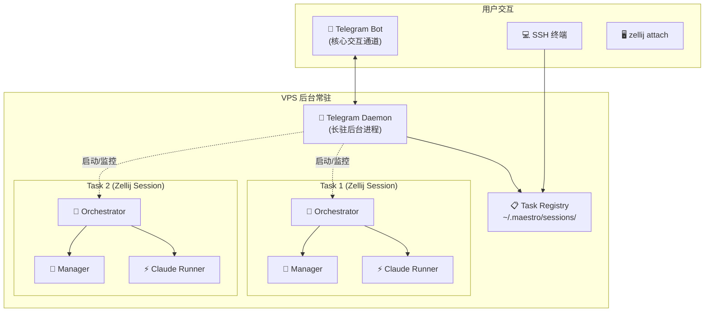

# Maestro 完整实现方案 (终稿 v5)

> [!IMPORTANT]
> 核心 CLI 能力均已通过真实命令验证：`-p --output-format json` ✅、`--resume <session_id>` ✅

---

## 一、架构总览



**核心设计**：每个任务在**独立的 Zellij Session** 中运行，互不干扰。Telegram Bot 作为**常驻守护进程**，负责任务的创建、监控和通知。

---

## 二、多任务并行

### 任务隔离模型

| 维度 | 说明 |
| :--- | :--- |
| **进程隔离** | 每个任务 = 独立 Python 进程，运行在独立 Zellij Session 中 |
| **会话隔离** | 每个任务有独立的 Claude `session_id`，互不干扰 |
| **目录隔离** | 每个任务指定独立的 `working_dir` |
| **状态隔离** | `~/.maestro/sessions/<task_id>/` 独立目录 |

### 任务注册表 (`~/.maestro/sessions/`)

```
~/.maestro/sessions/
├── abc12345/                    # Task 1
│   ├── state.json               # 实时状态
│   ├── inbox.txt                # 用户输入
│   ├── checkpoint.json          # 崩溃恢复
│   └── report.md
├── def67890/                    # Task 2
│   ├── state.json
│   ├── inbox.txt
│   └── ...
└── registry.json                # 全局任务列表
```

```python
# registry.json
{
    "tasks": {
        "abc12345": {
            "requirement": "帮我实现登录模块",
            "working_dir": "/home/user/project-a",
            "status": "executing",
            "created_at": "2025-02-23T11:30:00",
            "zellij_session": "maestro-abc12345"
        },
        "def67890": {
            "requirement": "重构支付接口",
            "working_dir": "/home/user/project-b",
            "status": "waiting_user",
            "created_at": "2025-02-23T11:45:00",
            "zellij_session": "maestro-def67890"
        }
    }
}
```

---

## 三、Telegram Bot (核心模块)

### 命令列表

| 命令 | 说明 | 示例 |
| :--- | :--- | :--- |
| `/run <dir> <需求>` | 启动新任务 | `/run /home/user/myapp 帮我实现登录` |
| `/list` | 查看所有任务 | 返回任务列表+状态 |
| `/status <id>` | 查看指定任务详情 | `/status abc123` |
| `/ask <id> <消息>` | 给指定任务发指令 | `/ask abc123 别改数据库` |
| `/abort <id>` | 终止指定任务 | `/abort abc123` |
| `/report <id>` | 获取任务报告 | 发送 Markdown 报告文件 |
| 直接回复通知消息 | 自动关联到对应任务 | 回复 ASK_USER 通知 |

### 消息格式

**任务列表 (`/list`)**：
```
📋 当前任务 (2 个运行中)

1️⃣ [abc123] 帮我实现登录模块
   📂 /home/user/project-a
   🔄 Turn 5/30 | 💰 $0.82 | ⏱️ 3m
   
2️⃣ [def678] 重构支付接口
   📂 /home/user/project-b
   ⚠️ 等待你的回复 | 💰 $0.35
```

**轮次推送**：
```
📤 [abc123] Turn 3/30
🔧 Claude 修改了 auth.py, middleware.py
💰 $0.21 | ⏱️ 44s
🤖 Manager: 代码已修改，下一步跑测试
```

**ASK_USER 推送**：
```
⚠️ [def678] 需要你的决定

发现项目使用了两套鉴权方案 (JWT + Cookie)，
不确定是否全部替换为 Session

👉 直接回复本条消息告诉 Agent 你的决定
```

**完成推送**：
```
✅ [abc123] 任务完成！
📊 5 轮 | ⏱️ 3m12s | 💰 $0.82
📝 修改: auth.py, test_auth.py, router.py, middleware.py
🧪 测试: 全部通过
📄 /report abc123 查看详情
```

### Telegram Daemon 架构

```python
class TelegramDaemon:
    """
    常驻后台进程，通过 systemd 或 Zellij 管理。
    职责：
    1. 监听 Telegram 消息
    2. 监控所有 task 的 state.json 变化
    3. 推送通知
    4. 将用户回复路由到正确的 task inbox
    """
    
    def start(self):
        # 在独立 Zellij session 中运行: maestro-daemon
        # 启动方式: maestro daemon start
        pass
    
    def _on_run_command(self, chat_id, working_dir, requirement):
        """收到 /run → 创建 task → 启动 Zellij session"""
        task_id = self._generate_id()
        # 在新 Zellij session 中启动 orchestrator
        subprocess.Popen([
            "zellij", "--session", f"maestro-{task_id}",
            "--", "maestro", "_worker", task_id, requirement
        ])
    
    def _monitor_loop(self):
        """轮询所有 task 的 state.json，检测状态变化并推送"""
        while True:
            for task_id in self._list_tasks():
                state = self._read_state(task_id)
                if self._has_changed(task_id, state):
                    self._push_update(task_id, state)
            time.sleep(2)
```

---

## 四、CLI 命令

```bash
# 守护进程管理
maestro daemon start              # 启动 Telegram daemon（首次使用）
maestro daemon stop               # 停止 daemon

# 任务管理
maestro run "需求描述"             # 启动任务（当前目录）
maestro run -d /path/to "需求"    # 启动任务（指定目录）
maestro list                      # 查看所有任务
maestro status [task_id]          # 查看任务状态
maestro ask <task_id> "消息"      # 给任务发消息
maestro abort <task_id>           # 终止任务
maestro resume <task_id>          # 恢复崩溃的任务
maestro report <task_id>          # 查看任务报告

# 实时观看
zellij attach maestro-<task_id>   # attach 到任务的 Zellij session
```

---

## 五、完整目录结构

```
Maestro/
├── pyproject.toml
├── config.example.yaml
├── src/maestro/
│   ├── __init__.py
│   ├── cli.py                 # 命令行入口 (所有子命令)
│   ├── config.py              # 配置加载
│   ├── orchestrator.py        # 🎯 单任务调度核心
│   ├── claude_runner.py       # ⚡ Claude CLI subprocess
│   ├── manager_agent.py       # 🧠 Manager Agent
│   ├── llm_client.py          # 🔌 通用 LLM 客户端
│   ├── state.py               # 📊 状态机 + 熔断器
│   ├── context.py             # 📚 上下文管理
│   ├── session.py             # 🖥️ Zellij 管理 (含自动安装)
│   ├── telegram_bot.py        # 📱 Telegram Bot + Daemon
│   ├── registry.py            # 📋 多任务注册表
│   ├── notifier.py            # 📢 通知抽象层 (Telegram + 日志)
│   └── reporter.py            # 📝 报告生成
└── tests/
```

---

## 六、配置文件

```yaml
manager:
  provider: deepseek
  model: deepseek-chat
  api_key: ${DEEPSEEK_API_KEY}
  base_url: https://api.deepseek.com
  max_turns: 30
  max_budget_usd: 5.0
  request_timeout: 60
  system_prompt: |
    你是资深工程师助手...
    必须以 JSON 回复: {"action":"...","instruction":"...","reasoning":"..."}

claude_code:
  command: claude
  auto_approve: true
  timeout: 600
  # working_dir 由每个任务单独指定

context:
  max_recent_turns: 5
  max_result_chars: 3000

safety:
  max_consecutive_similar: 3

telegram:
  bot_token: ${TELEGRAM_BOT_TOKEN}
  chat_id: ${TELEGRAM_CHAT_ID}       # 授权用户 ID
  push_every_turn: true
  ask_user_timeout: 3600

logging:
  dir: ~/.maestro/logs
  level: INFO
```

---

## 七、边界防御

| # | 场景 | 应对 |
| :---: | :--- | :--- |
| 1 | Claude 鉴权失效 | 中止 + Telegram 通知 |
| 2 | 死循环 | 指令 hash 重复检测 → 熔断 |
| 3 | 长耗时超时 | subprocess timeout → Manager 决定 |
| 4 | 费用超限 | 累计 cost → 熔断 |
| 5 | Manager API 故障 | 指数退避 3 次 → ASK_USER |
| 6 | Python 崩溃 | checkpoint + `maestro resume` |
| 7 | Zellij 未安装 | 自动安装预编译二进制 |
| 8 | Claude 返回异常 | 捕获 + 交 Manager |
| 9 | Telegram 网络中断 | 降级日志模式，恢复后自动重连 |
| 10 | ASK_USER 无人回复 | 超时自动 ABORT |
| 11 | 多任务资源竞争 | 任务间完全隔离（进程/会话/目录） |
| 12 | Daemon 崩溃 | Zellij session 保活，`maestro daemon start` 重启 |

---

## 八、分阶段实施

### Phase 1: 核心闭环 + Telegram MVP
`config.py` → `llm_client.py` → `claude_runner.py` → `manager_agent.py` → `state.py` → `context.py` → `orchestrator.py` → `session.py`（Zellij 自动安装）→ `telegram_bot.py`（基础命令：`/run` `/status`）→ `notifier.py` → `cli.py`（`run` `status`）→ `registry.py`
**验证**：Telegram 发 `/run` 启动任务，自动推送进度，完成后推送报告

### Phase 2: 多任务 + 交互完善
多任务并行 → `/list` `/ask` `/abort` → `maestro resume` → `reporter.py` → `/report`
**验证**：同时运行 2 个任务，各自独立完成

### Phase 3: 稳定性加固
熔断器调优 → 上下文压缩 → Daemon 自恢复 → 日志清理 → 完整测试套件
**验证**：7x24 长时间运行稳定性

